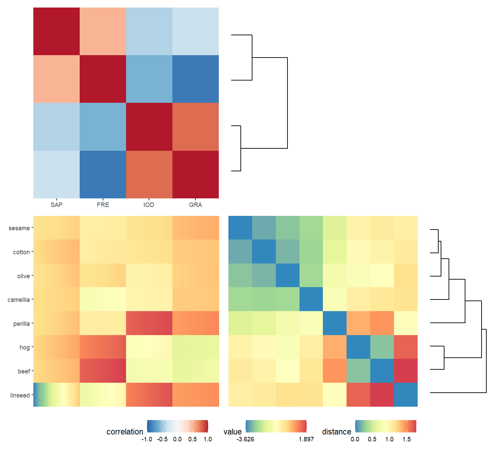
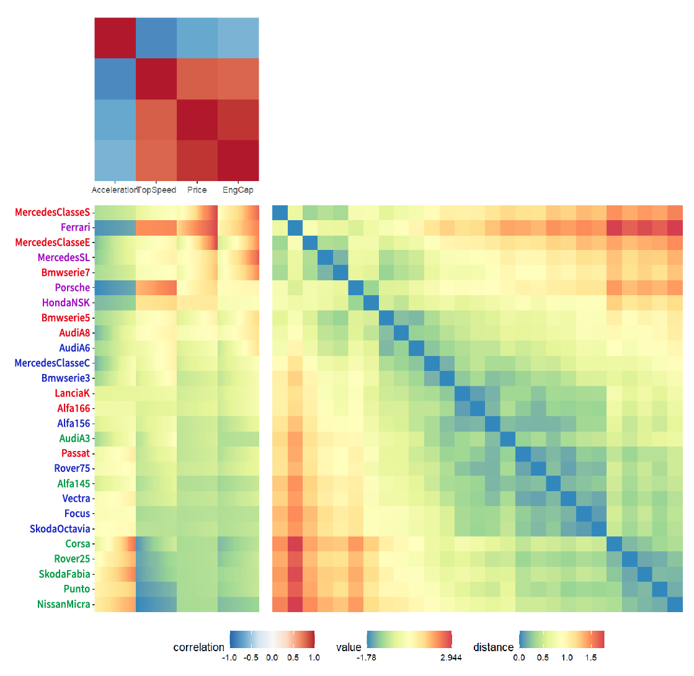

# iGAP：Matrix visualization for interval value based on GAP framework in R

R language is highly popular in the statistical field, with many innovative statistical methods being released as R packages. This study aims to implement Generalized association plots (GAP) for interval data in R, supported by a vast repository of symbolic interval data and algorithmic packages in R. GAP is an extension of Matrix visualization (MV). 

Focusing particularly on the Exploratory data analysis (EDA) of symbolic interval data, the study facilitates data to narrate its story before applying complex statistical methods. To this end, we have developed a package named iGAP, integrating the GAP concept into R, enabling the arrangement and visualization of interval data for users to quickly and clearly understand the relationships and patterns within the data. We believe that GAP, as an advanced tool for EDA in R, can be applied to interval data and potentially extended to various data types in the future.

### github 

`devtools::install_github("cocolo300/iGAP")`

## Visualization Example

```{r library}
library(iGAP)
```

Oils is the interval data provided in the RSDA suite. This data includes 8 different brands of cooking oil and four variables.

```{r ggInterval_boxplot,eval=FALSE}
 iGAP(oils, standardize_condition = T, cor_up = "BG",
     distance_right = "Hausdorff", normalize_right = T,
     SpanNormalize_right = T, euclidea_right = T, method_up = "single",
     method_right = "single")    
```
</img>


Cars.int is provided by the dataSDA package.

```{r ggInterval_boxplot,eval=FALSE}
 nameCars.int <- Cars.int[-5]
 rownames(nameCars.int) <- c("Alfa145", "Alfa156", "Alfa166",
     "AudiA3", "AudiA6", "AudiA8", "Bmwserie3", "Bmwserie5",
     "Bmwserie7", "Ferrari", "Punto", "Focus", "HondaNSK",
     "LanciaK", "MercedesSL", "MercedesClasseC", "MercedesClasseE",
     "MercedesClasseS", "NissanMicra", "Corsa", "Vectra", "Porsche",
     "Rover25", "Rover75", "SkodaFabia", "SkodaOctavia", "Passat")

 iGAP(nameCars.int, standardize_condition = T, cor_up = "BG",
     distance_right = "Hausdorff", normalize_right = T,
     SpanNormalize_right = T, euclidea_right = T, method_up = "R2E",
     method_right = "R2E")           
```
</img>

We can understand the information from the graph, allowing users to quickly and clearly understand the relationships and patterns between the data.

## References

<p id="ref1">
1. Chen, C. H. (2002). Generalized association plots: Information visualization via iteratively generated correlation matrices. Statistica Sinica, 7-29.
</p>


<p id="ref2">
 2. Billard L. and Diday E. (2006). Symbolic data analysis: Conceptual statistics and data mining. Wiley, Chichester.
 </p>

 <p id="ref3">
3. Kao, C. H., Nakano, J., Shieh, S. H., Tien, Y. J., Wu, H. M., Yang, C. K., & Chen, C. H. (2014). Exploratory data analysis of interval-valued symbolic data with matrix visualization. Computational Statistics & Data Analysis, 79, 14-29.
</p>

<p id="ref4">
 4. Jiang and Wu, B.S., 2022. ggESDA: Exploratory Symbolic Data Analysis with ’ggplot2’.
 </p>

